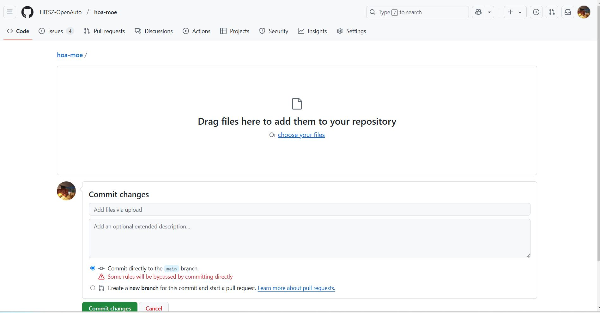

带 * 号表示选修。

本系列文章并不教学 Git，我们专注于操作而不详解原理；如有学习需要请移步互联网。

## 稳定连接到 GitHub
> 如果你已有合法访问国际互联网途径，或者能确保 GitHub 的稳定访问，可跳过。什么叫「稳定访问」？如果你不确定，那就是不能！🤣

参见我们的博客 [《新人指南：不使用第三方工具访问 GitHub》](https://hoa.moe/blog/access-github/)，任意一种方式均可。

## 本地 和 远程
一般来说，**本地/local** 文件指的是你的电脑磁盘上的文件，而 **远程/remote** 文件指的是存储在服务器上的数据文件。

在 HOA 的语境下，本地文件 指的是你存在自己电脑上、想要提交到我们的仓库里的文件，而 远程仓库 则是我们在 GitHub 上的 [各个仓库](https://github.com/HITSZ-OpenAuto)。
所谓的贡献文件，实际上就是通过 GitHub 提供的方法，将 本地文件 提交到 远程仓库 的过程。不过，如果只是编写文档，并不需要区分这些概念。

## *GitHub Codespaces

施工中...
<!-- ### 问题的产生
上面我们讲过，
> 所谓的贡献文件，实际上就是通过 GitHub 提供的方法，将 本地文件 提交到 远程仓库 的过程

但是，GitHub 提供的方法对 多文件上传、多文档修改 并不友好——

虽然，你可以在 GitHub 提供的界面中拖入多个文件上传，

*
我们会在后续的专题中讲解多文件上传
*

但正常来说，你并不希望文件在大仓库里堆成一团，而是放在文件夹里。**但，GitHub 并不支持在上面的界面中进行文件路径的修改！** 也就是说，你还得花费额外的步骤（即 Git 中 **commit** 的概念）把它放进文件夹。

类似地，在一个页面上只能修改一个文档。所以如果有一个改动、涉及到 5 个文档需要修改，就得进行五个独立的 步骤/commit；而按照逻辑，原本这 5 个文档的修改是*同一个改动引发*的，应该*属于同一步骤*。
这样会让仓库的修改历史过于零散。

### Git 方法
上面问题产生的根源是 **GitHub 的网页版不支持这么多功能**。
如果你有 Git 协助经历，那么解决问题的途径显而易见：只要把 **远程仓库** 仓库 clone/pull 下来到 **本地**，在 **本地** 使用 Git 一气呵成地修改完，再 push 到 **远程仓库** 就可以了。 -->

